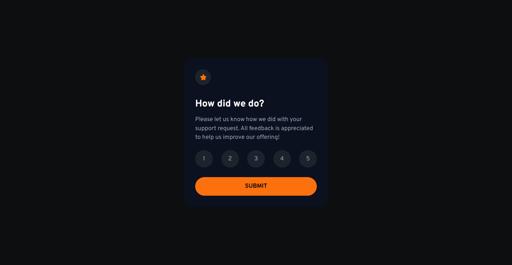

# Frontend Mentor - Interactive rating component solution

This is a solution to the [Interactive rating component challenge on Frontend Mentor](https://www.frontendmentor.io/challenges/interactive-rating-component-koxpeBUmI). Frontend Mentor challenges help you improve your coding skills by building realistic projects. 

## Table of contents

- [Overview](#overview)
  - [The challenge](#the-challenge)
  - [Screenshot](#screenshot)
  - [Links](#links)
- [My process](#my-process)
  - [Built with](#built-with)
- [Author](#author)
- [Acknowledgments](#acknowledgments)

## Overview

### The challenge

Users should be able to:

- View the optimal layout for the app depending on their device's screen size
- See hover states for all interactive elements on the page
- Select and submit a number rating
- See the "Thank you" card state after submitting a rating

### Screenshot

### Links

- Solution URL: [Add solution URL here](https://your-solution-url.com)
- Live Site URL: [https://aiy7788.github.io/interactive-rating-component/](https://aiy7788.github.io/interactive-rating-component/)

## My process

### Built with

- Semantic HTML5 markup
- Tailwind CSS (with custom theme tokens)
- Flexbox
- vite-plugin-svgr
- Mobile-first workflow
- TypeScript
- [React](https://reactjs.org/) - JS library

### Useful resources

- [React](https://react.dev/)
- [Tailwindcss](https://tailwindcss.com/)

## Author

- Frontend Mentor - [@AIY7788](https://www.frontendmentor.io/profile/AIY7788)

## Acknowledgments

Built independently as part of Frontend Mentor practice challenges.
